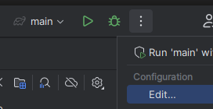
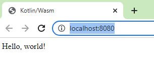
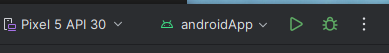
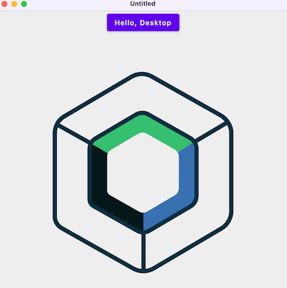

# 📚 Frontend development

Kotlin supports a wide selection of frontend frameworks across all platforms: mobile, desktop and web.

Please find below a glimpse of the possibilities that you can do right from IntelliJ:

- On the **Desktop** side
  - Thanks to JVM support, Kotlin supports [JavaFX](https://openjfx.io/).
    - :bulb: There is even a Kotlin counterpart called [tornadofx](https://tornadofx.io/).
  - [Compose Multiplatform](https://www.jetbrains.com/lp/compose-mpp/) brings Jetpack Compose to the desktop, the web and mobile.
- On the **Web**
  - [Ktor](https://ktor.io/docs/creating-interactive-website.html) can use templates engines [such as FreeMarker](https://freemarker.apache.org/) to create server pages.
  - With **KotlinJS**, developers can create React, nodsjs, or vanilla JS Apps using Kotlin.
  - Kotlin **WASM** compiles into *Web Assembly*. It can complement KotlinJS for computation intensive tasks.
- On **Mobiles**
  - Android developers use the [Jetpack Compose](https://developer.android.com/jetpack/compose) UI Framework or the legacy **xml layouts**. It is experimental on iOS.

Kotlin supports cross platform frontend development thanks to **Kotlin MultiPlatform (KMP)**

## Kotlin Multiplatform (KMP)

>"The Kotlin Multiplatform technology is designed to simplify the development of cross-platform projects. It reduces time spent writing and maintaining the same code for different platforms while retaining the flexibility and benefits of native programming." [₁](https://kotlinlang.org/docs/multiplatform.html)

[KMP](https://blog.jetbrains.com/kotlin/2021/08/compose-multiplatform-goes-alpha/) relies on Kotlin native and other Kotlin features to help developers create projects that target multiple platforms using a common Kotlin code-base.


Many combinations of targets and use cases are possible:

- [Full-Stack web apps](https://kotlinlang.org/docs/multiplatform-full-stack-app.html): A project that contains a backend and a web app while sharing common logic.
- [Multiplatform libraries](https://kotlinlang.org/docs/multiplatform-library.html)

## Kotlin/JS and Kotlin/WASM

- Kotlin/JS can also target the web and even use web frameworks (such as react) in Kolitn.
- Kotlin WASM is another possibility to target the web but this will generate WASM instead of pure JS code.
  - It can be used for example to develop computation intensive libraries.
- Maybe we can do even more in the future with as all these technologies (Kotlin, WASM and Kotlin/WASM) evolve. - For example, [WASI](https://wasi.dev/) allows WASM to communicate with the operating system. - This means that me may see Kotlin/WASM project projects in the future that can target both the browser and the OS.
- Let's keep watching 😄.

### 🧪 Kotlin/WASM web app

- Both Kotlin/WASM and Kotlin/JS wizards on IntelliJ work similarly.
  - The IDE generates a Kotlin file that will compile later WASM and / or JS. Kotlin/JS generated only JS while Kotin/WASM generates both JS and WASM.
  - In both cases, the entry point of the generated code is a JS file called **module_name.js**.
  - The IDE also generates an **index.html** in the resources folder which loads the generated JS explained above (the one named **module_name.js**).
  - The task `wasmBrowserDevelopmentRun` or `jsWasmBrowserDevelopmentRun` will run a local server that hosts both the **index.html** files and the generated JS and WASM files.
- Let's create a Kotlin/WASM app. First, Enable the kotlin wasm wizard by enabling **kotlin.wasm.wizard** in IntelliJ's registry (open the registry by double tapping shift and typing "registry" in the search box) or clone [this project](https://github.com/worldline/learning-kotlin/tree/main/material/kotlin-wasm-starter).


- Check that kotlin is set to at least **1.8.20** in **build.gradle.kts** (the wizard may set it to a previous version).
- Open **src/wasmMain/kotlin/sample.kt** and click on the run button that appears next to the `main` function.
- If the build fails because the IDE used the wrong gradle task (the one that corresponds to a KotlinJS project), please change it to `wasmBrowserDevelopmentRun` and try to run again.




- The development server should start and you can open your WASM powered webapp on [http://localhost:8080/](http://localhost:8080/)
- ⚠️ You may need to activate some flags on your browser for the app to work. If you see a blank page, please read the browser logs to check for the instructions.



- The generated wasm file is available in **build/js/packages/project_name/kotlin**
- WASM being a binary format, we need to convert it first to text format.
  - We can either install [WABT (The WebAssembly Binary Toolkit or wabbit)](https://github.com/WebAssembly/wabt) and use the _wasm2wattool_ `wasm2wat --enable-all  -v .\kotlin-wasm-demo-wasm.wasm -o wasm.wat`,
  - or use an online converter [such as this one](https://webassembly.github.io/wabt/demo/wasm2wat/)
  - ❗ However, I couldn't get it to work

### 🧪 KotlinJS web app

The Kotlin/JS wizard creates a very similar app to the Kotlin/WASM.
in a later PW, we'll create a fullstack app with Ktor and Kotlin/JS.

## Compose multiplatform

> "Compose Multiplatform simplifies and accelerates UI development for Desktop and Web applications, and allows extensive UI code sharing between Android, iOS, Desktop and Web. It's a modern toolkit for building native UI. Quickly bring your app to life with less code, powerful tools, and intuitive Kotlin APIs."


```kotlin
Button(
  onClick = {
    logger.info("Pressed!")
  }
) {
  Text("Hello $platform")
}
```

It is based on [Android Jetpack Compose](https://developer.android.com/jetpack/compose) declarative UI approach ( which is similar also to [iOS SwiftUI](https://developer.apple.com/xcode/swiftui/) ) [1](https://www.jetbrains.com/lp/compose-multiplatform/)


::: tip Compose multiplatform vs Jetpack Compose

While very similar, Compose multiplatform is different from Jetpack Compose as the latter is only compatible with Android.
Google provides a [JetPack compose tutorial](https://developer.android.com/jetpack/compose/tutorial) for Android development.

:::

::: warning Compose HTML is not cross-platform

Compose HTML is UI a library targeting Kotlin/JS which is not compatible with Compose Multiplatform (it is a different API).
For cross-platform UI development with Compose Multiplatform, compose Web is the choice.

:::

### 🧪 Create a Compose multiplatform app

We'll create a multiplatform app using the [official template](https://github.com/JetBrains/compose-multiplatform-template).
At the time of writing, this template does not include a compose web target.

- Please check that your environment is correctly setup [as explained here](https://github.com/JetBrains/compose-multiplatform-template#set-up-the-environment).
  - On Windows and Linux, we don't need to install iOS/macOS related tools but and we won't be able to run iOS/macOS targets.
  - If we don't want to install Android Studio, we need at least to install the Android SDK either through the official installer or from the _"Languages and Framework -> Android SDK"_ menu in the settings.
- Open the [official template](https://github.com/JetBrains/compose-multiplatform-template) and either download a zip or use the "_use this template_" options on GitHub.
- Open the downloaded projet. You'll note that it contains these modules:
  - a **shared** module (or subproject) that contains common code as well as
  - and another module for earch targeted platform: androidApp, iOSApp and desktopApp (When web will be included in the template, we should also see a webApp project). These contain the source code of the apps itself (such as the main activity in Android, the `@main App` in iOS and the main function in desktopJVM) and well as platform specific resources that cannot be placed in the _shared_ module. Some examples of such files are the _AndroidManifest.xml_ for android and the **info.plist** in iOS.
- In order to run the desktopApp, open a terminal on the project root folder and launch this command: `./gradlew desktopApp:run`.
- In order to run the Android App, the simplest way is to launch it from IntelliJ . It is also possible [define a gradle task](https://gist.github.com/MoshDev/a61080cc5e1f5bafdf3cc0bf70fd86fd) that installs the app on the device and issues a command to the device to launch it.
- In order to run the iOS App, the simplest way is to run it on the simulator using IntelliJ. In order to run it on a real device, the TramID needs to be defined as [explained here](https://github.com/JetBrains/compose-multiplatform-template#on-ios)



### 🧪 Playing with the Compose multiplatform API

Compose multiplatform is a component based declarative UI framework.
Each component is called a `Composable` and is defined as a function annotated with `@Composable`.

In compose multiplatform, the main component (the component at the root of the App) is usually found in **shared/src/commonMain/Kotlin/App.kt**.

- Take a look at **shared/src/commonMain/Kotlin/App.kt**, run the app and try to understand how compose works.
- Let's create a new composable called `RandomNumberList`.

```kotlin
@Composable
fun RandomNumberList(){
    // Generate a list of random numbers
    val myRandomValues = List(5) { Random.nextInt(0, 30) }
    // LazyColumn is a vertically scrolling list that renders items on demand
    LazyColumn {
        items(myRandomValues.size){
            Text(text = "$it")
        }
    }
}
```

- Place this composable below `AnimatedVisibility` and `Button` and run the app.

```kotlin
/*
Button(onClick ...
AnimatedVisibility(showImage) { ...
*/
RandomNumberList()
```

- Exercise: Make the "Hello, .." button switch between showing the list and and the image.

## Further reading

- [The huge potential of Kotlin/WASM](https://seb.deleuze.fr/the-huge-potential-of-kotlin-wasm/)
