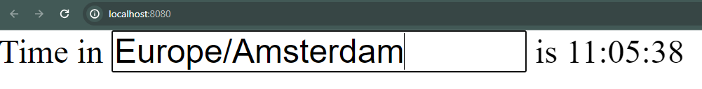

# Frontend development (overview)

Kotlin supports a wide selection of frontend frameworks across all platforms: mobile, desktop and web.

Please find below a glimpse of the possibilities that you can do right from IntelliJ:

- On the desktop side
  - Thanks to JVM support, Kotlin supports [JavaFX](https://openjfx.io/).
    - :bulb: There is even a Kotlin counterpart called [tornadofx](https://tornadofx.io/).
  - [Compose Multiplatform](https://www.jetbrains.com/lp/compose-mpp/) brings Jetpack Compose to the desktop, the web and mobile.
- On the web
  - [Ktor](https://ktor.io/docs/creating-interactive-website.html) can use templates engines [such as FreeMarker](https://freemarker.apache.org/) to create server pages.
  - With KotlinJS, developers can create React, nodsjs, or vanilla JS Apps using Kotlin.
  - Kotlin WASM compiles into Web Assembly. It can complement KotlinJS for computation intensive tasks.
- On mobiles
  - Android developers use the [Jetpack Compose](https://developer.android.com/jetpack/compose) UI Framework or the legacy **xml layouts**. It is experimental on iOS.

Kotlin supports cross platform frontend development thanks to **KMP and KMM**

## KMP & KMM

KMP (Kotlin Multiplatform) and KMM (Kotlin Multiplatform Mobile) are the two Kotlin technologies that allow to share a single codebase across multiple targets.

[KMP](https://blog.jetbrains.com/kotlin/2021/08/compose-multiplatform-goes-alpha/) relies on Kotlin native and other Kotlin features to help developers create projects that target multiple platforms using a common Kotlin code-base.


Many combinations of targets and use cases are possible:

- [Full-Stack web apps](https://kotlinlang.org/docs/multiplatform-full-stack-app.html): A project that contains a backend and a web app while sharing common logic.
- [Multiplatform libraries](https://kotlinlang.org/docs/multiplatform-library.html)
- [KMM](https://kotlinlang.org/lp/mobile/): a special denomination for KMP when used for iOS and Android projects.

KMM is based on KMP and focuses on helping mobile developers create Cross-Platform SDK for common code.


## Kotlin/JS and Kotlin/WASM

Kotlin/JS can also target the web and even use web frameworks (such as react) in Kolitn.

Kotlin WASM is another possibility to target the web but this will generate WASM instead of pure JS code.
It can be used for example to develop computation intensive libraries.
Maybe we can do even more in the future with as all these technologies (Kotlin, WASM and Kotlin/WASM) evolve.
For example, [WASI](https://wasi.dev/) allows WASM to communicate with the operating system.
This means that me may see Kotlin/WASM project projects in the future that can target both the browser and the OS.
Let's keep watching ::smile::.

### PW: Kotlin/WASM web app

- Enable the kotlin wasm wizard by enabling **kotlin.wasm.wizard** in IntelliJ's registry (open the registry by double tapping shift and typing "registry" in the search box) or clone [this project](https://github.com/worldline/learning-kotlin/tree/main/material/kotlin-wasm-starter).


- Check that kotlin is set to at least **1.8.20** in **build.gradle.kts** (the wizard may set it to a previous version).
- Open **src/wasmMain/kotlin/sample.kt** and click on the run button that appears next to the `main` function.
- If the build fails because the IDE used the wrong gradle task (the one that corresponds to a KotlinJS project), please change it to `wasmBrowserDevelopmentRun` and try to run again.


- The development server should start and you can open your WASM powered webapp on [http://localhost:8080/](http://localhost:8080/)
- ⚠️ You may need to activate some flags on your browser for the app to work. If you see a blank page, please read the browser logs to check for the instructions.



- The generated wasm file is available in **build/js/packages/project_name/kotlin**
- WASM being a binary format, we need to convert it first to text format.
  - We can either install [WABT (The WebAssembly Binary Toolkit or wabbit)](https://github.com/WebAssembly/wabt) and use the _wasm2wattool_ `wasm2wat --enable-all  -v .\kotlin-wasm-demo-wasm.wasm -o wasm.wat`,
  - or use an online converter [such as this one](https://webassembly.github.io/wabt/demo/wasm2wat/)
  - However, I couldn't get it to work

### PW: KotlinJS web app

The Kotlin/JS wizard creates a very similar app to the Kotlin/WASM.
in a later PW, we'll create a fullstack app with Ktor and Kotlin/JS

## Compose

[Compose multiplatform](https://blog.jetbrains.com/kotlin/2021/08/compose-multiplatform-goes-alpha/) is a family of declarative UI frameworks for Android (Jetpack Compose), the desktop (Compose Desktop), and the web (Compose Web). It has experimental support for iOS.

::: warning state of compose multiplatform as of August 2022

Currently, IntelliJ can create compose projects that include both Android and Desktops.
The web platform is not yet included, but it is still possible to create Compose projects only for web or only for desktop.

For Android only compose apps (Jetpack Compose), please use **Android Studio**.

:::

Google provides a [JetPack compose tutorial](https://developer.android.com/jetpack/compose/tutorial) for Android development.

### PW: Compose web

- Create a new IntelliJ project -> Compose Multiplaform.
- Choose "Single platform" -> "Web" and fill the other fields.
- Choose **Finish**
- IntelliJ may take some time to prepare the project and may request to install additional plugins.
- Launch the development server of the web app sing this command ` ./gradlew jsBrowserRun --continuous`.
- Modify `Main.kt` as follows and run the app.
- Open this address: `localhost:8080`.

```kotlin
fun main() {
    renderComposable(rootElementId = "root") {
        Div({ style { padding(25.px) } }) {
            var expanded by remember { mutableStateOf(false) }
            Button(
                attrs = {
                    onClick { expanded = !expanded }
                }
            ) { Text("Click me") }
            Div({ style { display(if (expanded) DisplayStyle.Block else DisplayStyle.None) } }) {
                Text("Click me !")
            }
        }
    }
}
```


### PW: Compose desktop + Android app

- Create a new project on IntelliJ -> Compose Multiplatform.
- Choose "multiple platforms" and fill the other fields. Then choose **Finish**.
- IntelliJ starts preparing the project and may request to install plugins.
- Once ready, run the android app using the green run button.
- Run the Desktop app by running the main function on the desktop project (should be in `Main.kt`).
- Modify `App.kt` in the main project as follows and run the app.

```kotlin
@Composable
fun App() {
    val platformName = getPlatformName()
    Card {
        var expanded by remember { mutableStateOf(false) }
        Column(Modifier.clickable { expanded = !expanded }) {
            Text(
                text="Click me !",
                style = MaterialTheme.typography.h2
            )
            AnimatedVisibility(expanded){
                Text(
                    text = "Hello, ${platformName} 🎊",
                    style = MaterialTheme.typography.h1
                )
            }
        }
    }
}
```


## Further reading

- [The huge potential of Kotlin/Wasm](https://seb.deleuze.fr/the-huge-potential-of-kotlin-wasm/)
