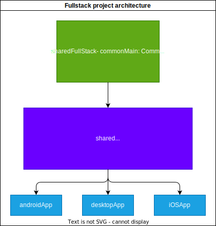
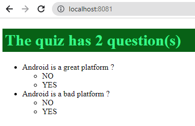
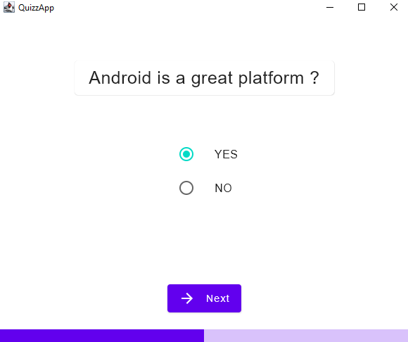
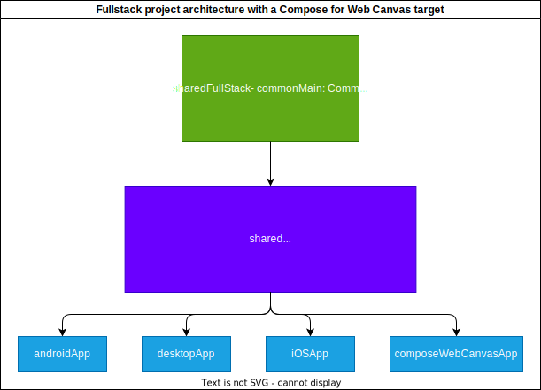
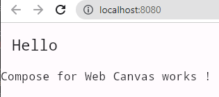

# Cross-plaform app Codelab

## PW : Cross-platform app + KMM + KMP for Android, iOS and Desktop

By combining KMP, KMM and Compose, it is possible to fully develop cross-platform mobile and desktop apps using only Kotlin.

This pw is so huge [that it has its own codelab](https://worldline.github.io/learning-kotlin-multiplatform/)

## PW : Add a Ktor server App

We'll extend the previous app with a Ktor server and a React web client.
The project will have the following architecture.
This architecture choice may be subject to discussion, but we'll stick with this for now.

- Add a module into the project called **sharedFullStack** which will contain:
  - In _commonMain_: Some shared code that will by used by the **shared** project.
  - In _jvmMain_: A Ktor server that serves a Rest API to provide the _questions_ and hosts some html files. One of the HTML files will load a react app that will be developed in Kotlin/JS.
  - In _jsMain_: A react web client. This target will only generate the JS code, the HTML page that loads this will be provided by Ktor server as explained above.
  - 💡 With IntelliJ you can right click on **xxxMain/kotlin** and **xxxMain/resources** folders and use **Mark Directory as** to get more support from the IDE.
- Update the build file of this new module as follows:
  - plugins: `multiplatform`, `serialilzation` and `application`. The latter will be used to specify the main file the server which will be run with the `run` task.
  - Add the `kotlin("multiplatform")` plugin and target all possible platforms (web, desktop, jvm ans mobile) for completeness.
  - The depdencies should be as follows:
    - _commonMain_: kotr client (since we want to add the API client into the shared code)
    - _jvmMain_: ktor server + json sertialzation + cors (so that the html can load the JS)
    - _jsMain_: Kotlin React
  - We need to add two tasks, the first one produces the JS react app and the other one copies into the resources of the Ktor server
  - Set the main class of the `application` plugin.
  - The file should [look as follows](https://github.com/worldline/learning-kotlin/blob/main/material/kmm-fullstack-demo/sharedFullStack/build.gradle.kts)
- Move the API model and client files from **shared** to **sharedFullStack** (`Anwser`, `Quiz`, `Question`, `QuizAPI` and `QuizRepository`)
- ⚠️ Some things to take note of:
  - In the android build file, add **io.netty.versions.properties** and **INDEX.LIST** to
  - Our global clean task may conflict with Kotlin/JS's one, if that the case, we can fix this by renaming our clean task in the root **build.gradle.kts**
    packagingOptions excludes.
- Write the necessary code for both the server and the client. The server should provide these endpoints:
  - A GET on `/` provides an html file that loads **sharedFullStack.js** because this is the name of the JS that is generated.
  - A GET on `/quiz` provides a JSON of server generated `Quiz`
  - A GET on `/quiz.html` servers a server generated HTML page using the HTML DSL
- Change the `QuizAPI` class so that it calls our local server _http://localhost:8081/quiz_ and remove the arguments of the json method above since the server sets the correct headers.
- Launch the gradle task "application -> run" of the **sharedFullStack** module, which will copy the generated JS into the Ktor server ressources folder.
- Open _http://localhost:8081_ to run the react App

- Run the desktop app which fetches the quiz from the local server.

- Testing on mobile is a little bit more complex because localhost may be mapped to another address non secure HTTP is blocked by default.

The final project is [available here](https://github.com/worldline/learning-kotlin/tree/main/material/kmm-fullstack-demo) in the **sharedFullStack** module.

## PW: Add a Compose for Web Canvas target (experimental)

Compose for Web Canvas allows to use the same API surface as Compose Desktop and Android.
Let's add another module to try this out.

- Add a module named **composeWebCanvasApp** and define it as a Kotlin/JS web app.
  - add `src/jsMain/kotlin` folder and `src/jsMain/resources` folder
  - 💡 With IntelliJ you can right click on these folders and use **Mark Directory as** to get more help later from the IDE.
- Set the **js** target in the build file with Compose for Web Canvas dependencies
  - The build file should be similar [to this one](https://github.com/worldline/learning-kotlin/blob/main/material/kmm-fullstack-demo/composeWebCanvasApp/build.gradle.kts)
- In the resources folder, create an index.html file that loads the JS files:
  - The one that is generated by Kotlin/JS and should be named **composeWebCanvasApp.js**.
  - **skiko.js** which is dependency of Compose for Web Canvas.
  - Here is an example [of such file](https://github.com/worldline/learning-kotlin/blob/main/material/kmm-fullstack-demo/composeWebCanvasApp/src/jsMain/resources/index.html)
- ⚠️ The current `App()` imported from main crashes on this target because we are not using precompose for the web. In the current correction we just place a `Text` while we look for a fix.
  - Add this [Kotlin file](https://github.com/worldline/learning-kotlin/blob/main/material/kmm-fullstack-demo/composeWebCanvasApp/src/jsMain/kotlin/tech/worldline/demo/BrowserViewportWindow.kt) which defines a `BrowserViewportWindow` that allows to render a composable into a Canvas.
  - Add this [Kotlin file](https://github.com/worldline/learning-kotlin/blob/main/material/kmm-fullstack-demo/composeWebCanvasApp/src/jsMain/kotlin/tech/worldline/demo/AppTheme.kt) which defines a default theme for the App
  - The main Kotlin file has [the following code](https://github.com/worldline/learning-kotlin/blob/main/material/kmm-fullstack-demo/composeWebCanvasApp/src/jsMain/kotlin/tech/worldline/demo/MainWeb.kt)
- Run the app by launching the `jsBrowserDevelopmentRun` gradle task of the **composeWebCanvasApp** module.

The final project is [available here](https://github.com/worldline/learning-kotlin/tree/main/material/kmm-fullstack-demo) in the **composeWebCanvasApp** module.

## Going futher

- Add a Compose Web target to the project

## Sources and references

- [Full Stack JVM & JS App Hands-On Lab](https://github.com/kotlin-hands-on/jvm-js-fullstack)
- [Build a full-stack web app with Kotlin Multiplatform](https://kotlinlang.org/docs/multiplatform-full-stack-app.html)
- [Build a web application with React and Kotlin/JS — tutorial](https://kotlinlang.org/docs/js-react.htm)
- [JetBrains/skiko](https://github.com/JetBrains/skiko)
- [burnoo/DemoListApp](https://github.com/burnoo/DemoListApp)
