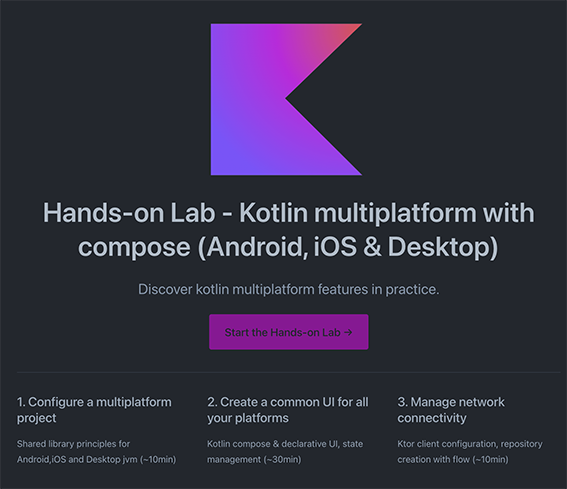

# 🛠 Let's make a cross-plaform app !

By combining KMP and  Compose, it is possible to fully develop cross-platform mobile, web and desktop apps using only Kotlin.

#### Prerequisites

- Basic knowledge of kotlin development (nullability,inline & lambda functions mainly)
- [Android Studio IDE](https://developer.android.com/studio) with latest stable version **Giraffe** version or above 
- A good connectivity

::: tip
For more information about your DEV environment and installs please have a look to jetbrain related [docs](https://kotlinlang.org/docs/multiplatform-mobile-setup.html#next-step)
:::

# [ _____ 🚀 Start the practical work here 🚀_____](https://worldline.github.io/learning-kotlin-multiplatform/overview/)
  
