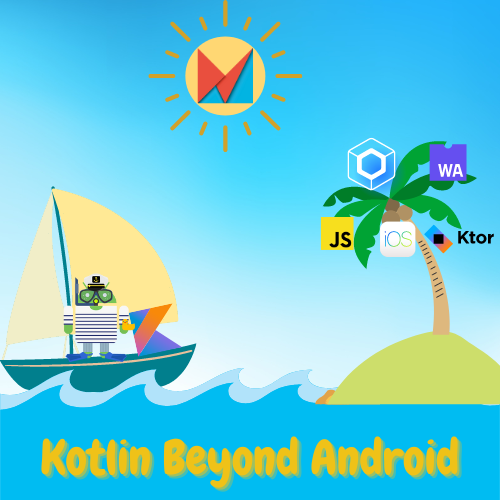

# 📅 Workshops

## (2023) Android makers : Kotlin Beyond Android

### Link

Workshop link: [awl.li/am23-kt](https://awl.li/am23-kt)

### Agenda

- [Backend development: Rest API with Ktor](../backend-development/#ktor)
- Optional: [Backend development: Rest API with nodeJS and Kotlin/JS](../backend-development/#ktor)
- [Front-end development: Kotlin/WASM and Kotlin/JS webapp](../front-development/#kotlin-js-and-kotlin-wasm)
- [Front-end development: cross-platform Hello world App with Compose multiplatform](../front-development/#compose)
- [Front-end development: Cross-platform Quiz App with Compose multiplatform](https://worldline.github.io/learning-kotlin-multiplatform/)
- [Full-stack development: Quiz App with Compose multiplatform and Ktor server](../other-technologies/#pw-add-a-ktor-server-app)

## (2023) JNation : Let's discover the possibilities of Kotlin

### Link

Workshop link: [awl.li/jnation23-kt](https://awl.li/jnation23-kt)

![qr code](data:image/gif;base64,R0lGODdhkgCSAIAAAAAAAP///ywAAAAAkgCSAAAC/4yPqcvtD6OctNqLs968+w+G4kiW5omm6sq27gvH8kwD9o3jho3ogb8D9G4O3o94MAZzyKAzyUQqj9Ecpcp8LoVUrrZb5AKPw+rwixV7u+nrWmFsg8n07bkOhauz+Ls535cwBTEouBdlRzc1FvcW2MhX+PQ36XgnASllOVdmBbi4qdcpaajXWLl1OpGpaupIqbhGKgo1xlDoo8qq5pbKi8eo2Xl7SJuZSMyHHJsburCLWisrLE28HN08y9bEyUyNedgaaP2ZZm7bfS1Nquupbew+De53Xu96/+wJ7/tF6KwNzRCuTQPhKcvXjha5eQ0AhnvFrR+gS+UO4hMnkaK/c//YfiWM1TEkyJEfS9pbddKkSJUkPbpc+dKbHBED0dGrFxHYL1/B0DhzUTPnTZwQ6Y3SNzJjiGPbFOqMtgznMG9h2oEa2muOxaflfILiWI1qQ2o9K/4cSzHbN4TyzLoq+xWRWaYeroaN9I+bXXSwxM2UWawD0z9wd05Muk5vW59pi4rFMFhuYYl7IR60y/hwwccVKvNEmiiyxpZHJydWW/ldqa7btjYLvZh13MuG5dBWtxELbNSK2T3Ei/tuYKOkL4Dl/XmqQd2cLw6XHTNrR4w6I4NVjviv38DAO7cVvXr3b7nYt/etzT2eBdt5CT+n/D02Zq5Kd1GvKrl9fnWbodL//z/fUK+h5NRCWuU0H3XaoXeeU1sxNJqDmvTHVVC3VUfeI9PYtAGHAy5XoGZCCRfcZ54tNeKHq/FF0Ib6VeJQg+N4x5JvdHVjIYMZmsccjBm6UWOLN5Z1lFc76ijjX+BsZmOLIUolYmNShiXgWck41qSB8F0HoHxeMglaBFxaF9uV55lmYnzE+ajaW0eKF6FAPTbFWpprZveQBlYpFpWTOPLJlo/4+XeclfmwGV+AblE544Acwmake5C912WJf073JoYXjvYogelU+ml5MS0YKVIUWjooZ3HZiWdmU7oK6qYZOAqoeN2dCN+roCIaJ5CGbeliGFoWxyqh5nAaZqqn//7p0LAfFYsnqXK2eeiKmfKDGKK3jgjpp8tS6+x4jdG6nKShkuitY7169ySlPMLSZ6loRruWnuoueieX8WpqKnqlKoXfnq5ZNh6F2+maoJDMgUunfQgSDG1mCSNc5mnqoaTiVGol16qGpQG6arpFGnexc2SSW6eISQYrcmKTYhVetZb6FqfD9RWsJskwrxvysLBWeR9g864HMss9Mwr0Wrx5eCx0nV6Zr9IP09ya1A43uTK2ky4I74xu6jtXvfy6x7CZR3ZNLVEpiuuxxXiVbfE+jDZbNYvOzSw1PvYObCTPOH9LFrcHIgu3qMbue3fV/iXe6caqGrrvwZcGKnR0lP/faLJLigpLp8ZFM72nm8pSeqfW7HYuXGprhz7ti81ZK7rOdf+oIdmBFxqj5gp3TXSafLeOXOVvu46524ITHczmGPY9ecLPWjt88Mj3VjHzIc97/a9h24y6r+9OuDDbN584PNRzV4+x1fGwx/H4OZdPOeJei4m+zw2jP5vlMA9JfV31y9y6n6kscOSg1dGe9gAW2Y1fcose+CLnItoYMFkJnNrD/gW7+8EPe3Pa1oMqqJqASAxL4JPVxKKEtMr5yh+mw9WipAWrE/JHfPQrV5iu5q8KEexC+UMgrzyVNDCZ63C1y1QPjxe23sUMU8ZyXgRJhy4foi5onEOWoOg1rif/4o11uXHh9EaoKOWNTl5FG5lpCoeuK+bqMEuynLTyB0GAjQVthqIb04gYQy9hR4BdvGEd8xKc58lwVy2TY+xq5i4tCo+G3zujHw3JlmWpcYACW1+/yEi+R87PQEHxXPbAoyQ5TTJxpoOkhPR2oE+mJ2KifJ3nRrYus30seYn6GxSh1UgLQqmNR6Tl/prWuA4iyY9q29vnFFZKfHUsjxTjnv8Kk6XuKVNyzEShrZDIyzylUHX8g8ksc8YxEW5yjiVk2ZTg582xlTFugIllAOM3ziHOz3HFe+XgljgrChKJnCrKXbeCyTpJkqyXFYPmDrXHwycO7X6mbCUuIaZMbOUo/2pZeycVT2e4VkrQklUk5AkDis0KorKTU8wP3apZTZDCjWri5CI7k/lGhVLPoEps4CVfdyZd3pSgH9tZPj1JwoSC8oHkHCUAdfWy1AV1p0Ql0xjPhUh3mo+WghwmS90oTDL2lI3p6xPKmqjPUcnUhTndJwu5OlWxwrKoHtUjWlHIMDFqVK0uA2EOUfqfU46Tcavrq/uKmbKYflOql4PiBzNmPMEaj6LXGsECZ0jSx851i/rLK4oMZsHMheifgvuqNdPHvlSa9IJiqSQHc6qtkPrudjiDqe4wldDBRnFOZy3gKoFH198B9LUidajsbNutrZpkgbs1arvQ+MMjwgRw7JuZ6Du/KSOGdCecYmVu+Jy71tXK6qzb2ipxQpjI4BZ2owLl7sWUm0HwzlC8maPqvbLS3d4mbbWoWiRZ/wjf855FiJa0nXkV29C4AnKaudUmYxGbWjDWCogA7GZxxAlWBKtQh2alX6H+qh/iLhjAs7Ph9EKLtQyTdp8cDiWEaYDiFKt4xSxusYtfDOMYy3jGNK6xjW+M4xzreAMFAAA7 =350x)

### Agenda

- [Prerequisutes](../presentation/#prerequisites)
- Selection of Kotlin's languages features: [null safety](../kotlin-features/#null-safety) and [functions](../kotlin-features/#functions)
- [Backend development: Rest API with Ktor](../backend-development/#ktor)
- Optional: [Backend development: Rest API with nodeJS and Kotlin/JS](../backend-development/#ktor)
- [Front-end development: Kotlin/WASM and Kotlin/JS webapp](../front-development/#kotlin-js-and-kotlin-wasm)
- [Front-end development: cross-platform Hello world App with Compose multiplatform](../front-development/#compose)
- [Front-end development: Cross-platform Quiz App with Compose multiplatform](https://worldline.github.io/learning-kotlin-multiplatform/)
- [Full-stack development: Quiz App with Compose multiplatform and Ktor server](../other-technologies/#pw-add-a-ktor-server-app)

## (2023) Mobile DevOps summit

- Title: **From Android to Multiplatform: leveraging the full potential of Kotlin**
- Link: [awl.li/mds23-kt](https://awl.li/mds23-kt)

### Agenda

- [Initiate a cross-platform app](../other-technologies/#pw-add-a-ktor-server-app)
- Live examples of other Kotlin possibilities:
  - [Backend development: Rest API with Ktor](../backend-development/#ktor)
  - [Backend development: Rest API with nodeJS and Kotlin/JS](../backend-development/#ktor)
  - [Front-end development: Kotlin/WASM and Kotlin/JS webapp](../front-development/#kotlin-js-and-kotlin-wasm)

## (2024) MiXit

- Titre : **Développement front et back en Kotlin. Une visite guidée de KMP**

### Agenda

- [Prérequis](../presentation/#prerequisites)
- Fonctionnalités notables: [null safety](../kotlin-features/#null-safety) et [les fonctions](../kotlin-features/#functions)
- **Développement backend**
  - [Présentation d'introduction à Kotlin pour le développement backend](https://speakerdeck.com/yostane/kotlin-pour-le-developpement-backend)
  - [API Rest avec Spring boot](../backend-development/#spring-framework)
  - [API Rest avec Ktor](../backend-development/#ktor)
- **Développement frontend**
  - [Application "Hello World" avec Compose Multiplatform](../front-development/#compose)
- **Développement fullstack**
  - [Application de quiz avec Ktor + Compose Multiplatform](../other-technologies/#pw-add-a-ktor-server-app)
- **Autres fonctionnalités**
  - [Kotlin/WASM](../front-development/#kotlin-js-and-kotlin-wasm)
  - [Développement NodeJS en Kotlin](../backend-development/#nodejs)
  - [Coroutines](../kotlin-features-advanced/#concurrency-and-coroutines)
