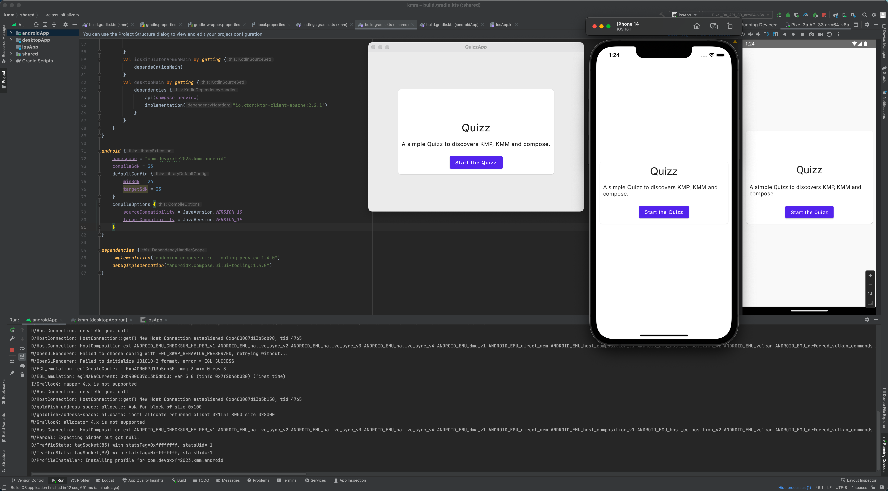

# 🛠 Construisons une app multiplateforme !

En combinant KMP, KMM et Compose, il est possible de développer des applications mobiles et de bureau multiplateformes en utilisant uniquement Kotlin.

#### Prérequis

- Connaissance de base du développement en Kotlin (notamment la nullabilité, les fonctions en ligne et les fonctions lambda)
- [IDE Android Studio](https://developer.android.com/studio) avec la version stable la plus récente, version **Giraffe** ou supérieure
- Une bonne connectivité

::: tip
Pour plus d'informations sur votre environnement de développement (DEV) et les installations, veuillez consulter la documentation liée à JetBrains [ici](https://kotlinlang.org/docs/multiplatform-mobile-setup.html#next-step).
:::

# [ ____ 🚀 Demarrer la session pratique ici 🚀___](https://worldline.github.io/learning-kotlin-multiplatform/)
  
