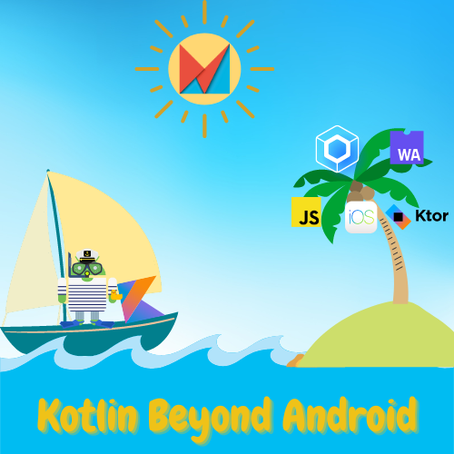

# 📅 Workshops

## Android makers 2023: Kotlin Beyond Android

### Liens

Lien du workshop: [awl.li/am23-kt](https://awl.li/am23-kt)

### Agenda

- [Backend development: Rest API with Ktor](../backend-development/#ktor)
- Optional: [Backend development: Rest API with nodeJS and Kotlin/JS](../backend-development/#ktor)
- [Front-end development: Kotlin/WASM and Kotlin/JS webapp](../front-development/#kotlin-js-and-kotlin-wasm)
- [Front-end development: cross-platform Hello world App with Compose multiplatform](../front-development/#compose)
- [Front-end development: Cross-platform Quiz App with Compose multiplatform](https://worldline.github.io/learning-kotlin-multiplatform/)
- [Full-stack development: Quiz App with Compose multiplatform and Ktor server](../other-technologies/#pw-add-a-ktor-server-app)

## Mobile DevOps summit 2023

- Titre: **From Android to Multiplatform: leveraging the full potential of Kotlin**
- Lien: [awl.li/mds23-kt](https://awl.li/mds23-kt)

### Agenda

- [Développement d'une application multi-plateformes](../other-technologies/#pw-add-a-ktor-server-app)
- Démonstration des autres possibilités:
  - [API Rest avec Ktor](../backend-development/#ktor)
  - [API Rest avec nodeJS et Kotlin/JS](../backend-development/#ktor)
  - [Webapp Kotlin/WASM et Kotlin/JS ](../front-development/#kotlin-js-and-kotlin-wasm)

## Devoxx Morocco 2023

- Titre: **Let's discover the amazing possibilities of Kotlin**
- Lien: [awl.li/mds23-kt](https://awl.li/devoxxma23-kt)

### Agenda

- [Prérequis](../presentation/#prerequisites)
- Caractéristiques notables de Kotlin: [le null safety](../kotlin-features/#null-safety) et [les fonctions](../kotlin-features/#functions)
- [API Rest avec Spring boot](../backend-development/#spring-framework)
- [API Rest avec Ktor](../backend-development/#ktor)
- [Développement d'une application multi-plateformes type "Hello World" avec Compose Multiplatform](../front-development/#compose)
- [Dévelopment sullstack d'une application de Quiz avec with Compose multiplatform en front et Ktor server en backend](../other-technologies/#pw-add-a-ktor-server-app)
- Autres fonctionnalités et possibilités:
  - [Kotlin/WASM](../front-development/#kotlin-js-and-kotlin-wasm)
  - [Serveur NodeJS avec Kotlin/JS](../backend-development/#nodejs)
  - [Coroutines](../kotlin-features-advanced/#concurrency-and-coroutines)

## (2024) MiXit

- Titre : **Développement front et back en Kotlin. Une visite guidée de KMP**

### Agenda

- [Prérequis](../presentation/#prerequisites)
- Fonctionnalités notables: [null safety](../kotlin-features/#null-safety) et [les fonctions](../kotlin-features/#functions)
- **Développement backend**
  - [Présentation d'introduction à Kotlin pour le développement backend](https://speakerdeck.com/yostane/kotlin-pour-le-developpement-backend)
  - [API Rest avec Spring boot](../backend-development/#spring-framework)
  - [API Rest avec Ktor](../backend-development/#ktor)
- **Développement frontend**
  - [Application "Hello World" avec Compose Multiplatform](../front-development/#compose)
- **Développement fullstack**
  - [Application de quiz avec Ktor + Compose Multiplatform](../other-technologies/#pw-add-a-ktor-server-app)
- **Autres fonctionnalités**
  - [Kotlin/WASM](../front-development/#kotlin-js-and-kotlin-wasm)
  - [Développement NodeJS en Kotlin](../backend-development/#nodejs)
  - [Coroutines](../kotlin-features-advanced/#concurrency-and-coroutines)
