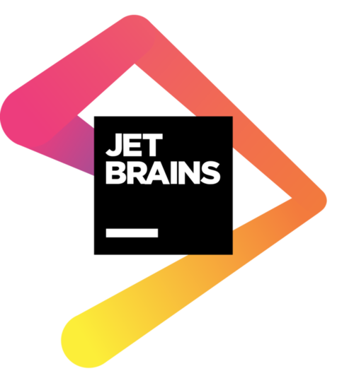
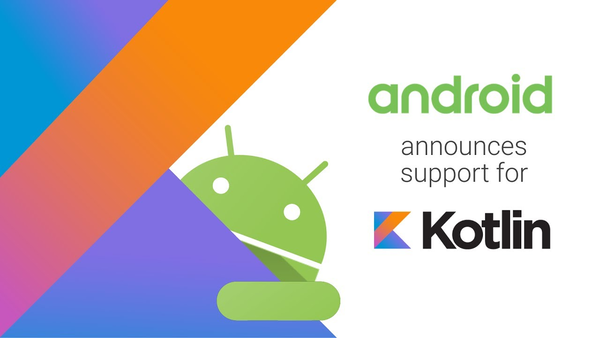
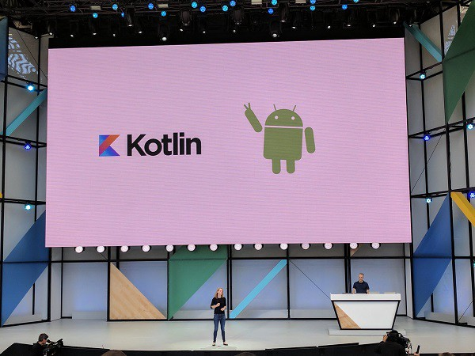
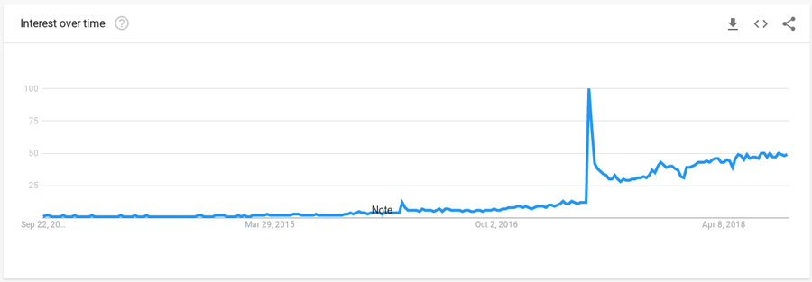

title: Learning Kotlin - Language & History!
class: animation-fade, middle, center, responsive
layout: true

<!-- This slide will serve as the base layout for all your slides -->
.bottom-bar[]

---

class: impact

---

class: impact

# Language & History!

- Developed by JetBreains
- Unveiled in July 2011
- Google I/O 2017: first-class support fir Kotlon on Android
- [Google I/O 2019: Kotlin is the preferred language for Android development](https://techcrunch.com/2019/05/07/kotlin-is-now-googles-preferred-language-for-android-app-development/)

---

# Some features

- Object oriented, functional
- Global functions

---

---

# [https://kotlinlang.org/](https://kotlinlang.org/)

---

---

---

---

# [https://developer.android.com/kotlin/](https://developer.android.com/kotlin/)

---

---

# [https://blog.gradle.org/kotlin-meets-gradle](https://blog.gradle.org/kotlin-meets-gradle)

---

---

# [https://spring.io/guides/tutorials/spring-boot-kotlin/](https://spring.io/guides/tutorials/spring-boot-kotlin/)

---

---

---

# [https://try.kotlinlang.org/](https://try.kotlinlang.org/)

---

# [https://kotlin.link/](https://kotlin.link/)

---

---

# [https://github.com/Kotlin](https://github.com/Kotlin)

---

# [Next!](./03_tooling.html)

