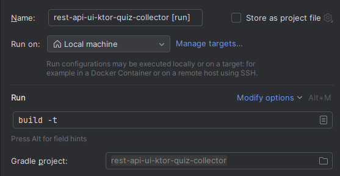

# Ktor + jupyter quiz collection

Enable dev mode

- Make sure development mode is enabled in your Ktor configuration file. This depends on how you created and run your
  server. If you use EngineMain to run a server, enable development mode in the configuration file.
- Add run task that runs `./gradlew -t build` and run it.

- Run the ktor server with `./gradlew run` or from a run task